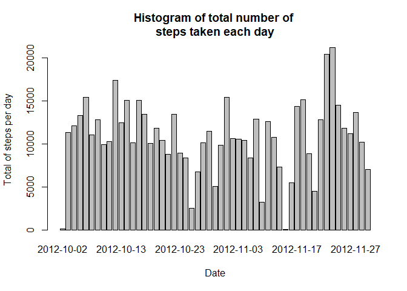
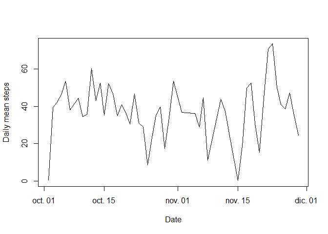
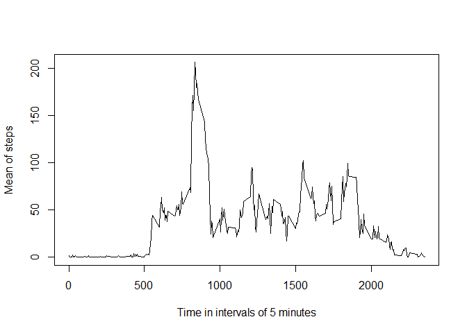
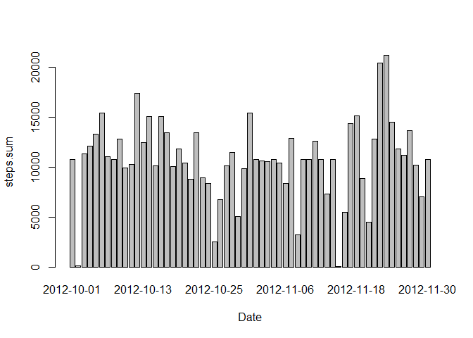

## Loading and preprocessing the data


```r
unzip(zipfile = "repdata_data_activity.zip")
df1<-read.table(file = "activity.csv",sep = ",",header = TRUE)
```

Once obtained the data frame we check the head


```r
print(head(df))
```

```
##                                               
## 1 function (x, df1, df2, ncp, log = FALSE)    
## 2 {                                           
## 3     if (missing(ncp))                       
## 4         .Call(C_df, x, df1, df2, log)       
## 5     else .Call(C_dnf, x, df1, df2, ncp, log)
## 6 }
```

Afterwards we can begin to preprocess the data by extracting the missing values and keep that data frame appart


```r
df<- df1[complete.cases(df1),]
```

Finally we can proceed with the calculation of the assignment requests.

## What is mean total number of steps taken per day?


Here is the code for reproducing that information


```r
histogramFrame <- tapply(df$steps,df$date,sum)
histogramFrame <- data.frame(date = row.names(histogramFrame),steps.sum=histogramFrame)
row.names(histogramFrame)<-c()

barplot(histogramFrame$steps.sum ~ as.Date(histogramFrame$date),xlab = "Date", main = "Histogram of total number of \nsteps taken each day",ylab = "Total of steps per day")
```

<!-- -->
 

 Here we calculate the median and the mean of steps taken per day
 
 
 ```r
 meanTable<-tapply(df$steps,df$date,mean)
 meanTable<-data.frame(date=row.names(meanTable),steps.mean=meanTable)
 row.names(meanTable)<-c()
 
 medianTable<-tapply(df$steps,df$date,median)
 medianTable<-data.frame(date=row.names(medianTable),steps.median=medianTable)
 row.names(medianTable)<-c()
 
 
 print(head(meanTable))
 ```
 
 ```
 ##         date steps.mean
 ## 1 2012-10-02    0.43750
 ## 2 2012-10-03   39.41667
 ## 3 2012-10-04   42.06944
 ## 4 2012-10-05   46.15972
 ## 5 2012-10-06   53.54167
 ## 6 2012-10-07   38.24653
 ```
 
 ```r
 print(head(medianTable))
 ```
 
 ```
 ##         date steps.median
 ## 1 2012-10-02            0
 ## 2 2012-10-03            0
 ## 3 2012-10-04            0
 ## 4 2012-10-05            0
 ## 5 2012-10-06            0
 ## 6 2012-10-07            0
 ```
 

Here is the plot of the average number of steps taken


```r
plot(as.Date(meanTable$date),meanTable$steps.mean,type = 'l',pch=19,xlab = 'Date',ylab = "Daily mean steps")
```

<!-- -->

## What is the average daily activity pattern?


```r
meandaily<-tapply(df$steps,df$interval,mean)
meandaily<-data.frame(interval=as.numeric(row.names(meandaily)),steps.mean=meandaily)

plot(meandaily$interval,meandaily$steps.mean,xlab="Time in intervals of 5 minutes",ylab = "Mean of steps",pch=19,type = 'l')
```

<!-- -->

It is possible to see that between the intervals 800 and 900 the mean of steps was superior than the other intervals.

## Imputing missing values


```r
missingVals<-sum(1*!complete.cases(df1))
```

The amount of rows with no NA values is 2304. The strategy to replace the missing values consist on using the mean for each interval to replace the values in the column steps


```r
library(plyr)
```

```
## Warning: package 'plyr' was built under R version 4.0.2
```

```r
dfnew<-df1

dfnew$steps[is.na(df1$steps)]<-mapvalues(df1$interval[is.na(df1$steps)],meandaily$interval,meandaily$steps.mean)
```

### Histogram of the total number of steps taken each day after missing values are imputed


Now we make a new histogram based on the new data frame.


```r
histoStrategy<-tapply(dfnew$steps, dfnew$date, sum)
histoStrategy <- data.frame(date=as.Date(row.names(histoStrategy)),steps.sum=histoStrategy)
row.names(histoStrategy)<-c()

barplot(steps.sum ~ as.Date(date),data=histoStrategy,xlab = "Date")
```

<!-- -->
 
 As expected, the dates with non missing values conserve their height but the dates with plenty of missing values give heights to each column, making a huge difference due to the used strategy. 
 
 

## Are there differences in activity patterns between weekdays and weekends?
